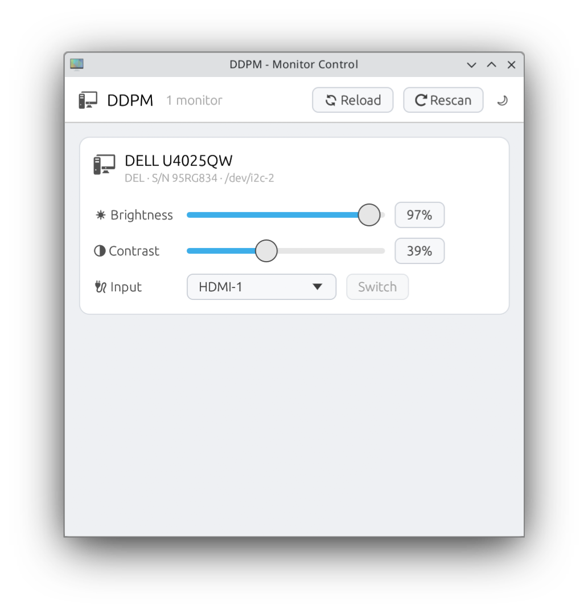

# DDPM

Monitor control for Linux — adjust **brightness**, **contrast** and **input source** of DDC/CI-capable monitors from a small desktop app.

[](https://github.com/chmelevskij/ddpm/actions/workflows/ci.yml)

<p align="center">
  <picture>
    <source media="(prefers-color-scheme: dark)" srcset="assets/screenshot-dark.png">
    
  </picture>
</p>

*Follows your system theme (dark/light), with a manual toggle in the toolbar.*

## Features

- Per-monitor brightness and contrast sliders — writes are throttled and coalesced, and the UI never blocks on the slow DDC/i2c protocol (all I/O runs on a worker thread)
- Input-source switching (DisplayPort / HDMI / USB-C / …) — the list comes from the monitor's own capabilities, and switching is a deliberate two-step action with read-back
- Rescan for hot-plugged monitors; values re-read on window focus, so changes made via the monitor OSD or `ddcutil` stay in sync
- Failed reads/writes are surfaced per monitor instead of silently ignored; misbehaving monitors get locked out after repeated failures with a Retry
- Monitors identified by model, serial and `/dev/i2c-N`

## Install

### From a release

Grab the latest `ddpm-*-x86_64-unknown-linux-gnu.tar.gz` from
[Releases](https://github.com/chmelevskij/ddpm/releases), unpack it, and put `ddpm` on your `PATH`
(the tarball also contains `ddpm.desktop` for your application launcher; point its `Exec=` at the binary's location).

### From source

Requires Rust, [`just`](https://github.com/casey/just), and on Debian/Ubuntu: `pkg-config` and `libudev-dev` (`just deps`).

```sh
just install     # cargo install + desktop entry for the current user (no sudo)
just uninstall   # remove it again
```

## First-time system setup

Your user needs access to the i2c device nodes:

```sh
just setup-i2c   # idempotent: i2c-dev module, `i2c` group, udev rule (uses sudo)
just doctor      # shows whether this machine is ready
```

Log out and back in after being added to the `i2c` group.

## Development

```sh
just             # list all recipes
just run         # run a debug build
just run-debug   # …with DDC-stack debug logging
just lint        # rustfmt check + clippy (warnings are errors)
just test        # unit tests
just ci          # lint + test + release build
```

## Releases & commit convention

This repo uses [Conventional Commits](https://www.conventionalcommits.org) and
[release-plz](https://release-plz.dev): pushes to `main` with releasable commits produce a release PR
(version bump + changelog); merging it tags the release, and CI builds and attaches the Linux binary
to the [GitHub release](https://github.com/chmelevskij/ddpm/releases).

| prefix | effect |
| --- | --- |
| `fix:` | patch release |
| `feat:` | minor release |
| `feat!:` / `BREAKING CHANGE:` | major release |
| `docs:` `ci:` `chore:` `refactor:` `test:` | no release on their own |

## License

[MIT](LICENSE)
